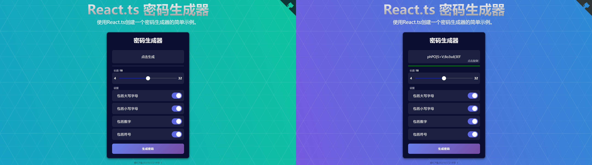

# 密码生成器Demo

    
    
    
    
    
    
    

使用密码生成器工具创建随机密码。

## Feature

- 随机生成密码
- 显示密码强度
- 可选密码选项(长度、大写/小写字母、数字、符号)
- 单击密码区域将密码复制到剪切板上

## Contribution

vite+react 实现，欢迎 star、issue、pr、fork（尽量标注原仓库地址）

## License

[GNU GENERAL PUBLIC LICENSE Version 3](LICENSE.md)